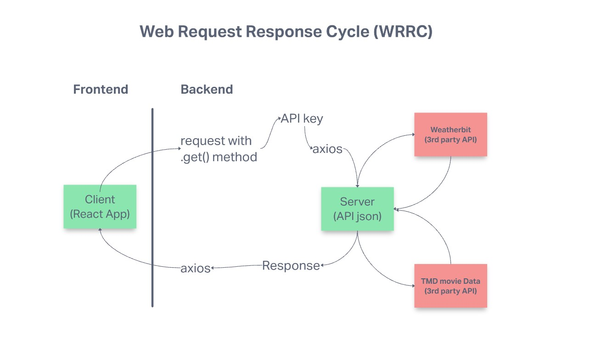
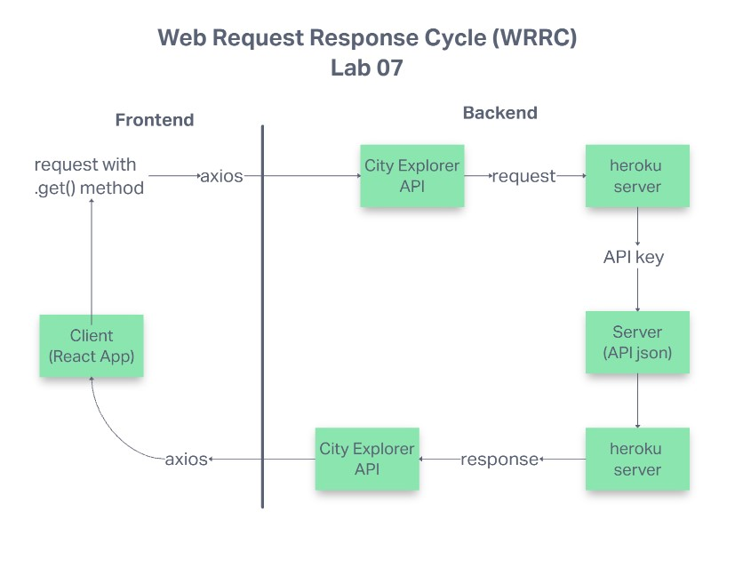

# City Explorer

## Deployed Site [City Explorer](https://rdball-city-explorer.netlify.app/)

**Author**: Robert Ball

**Version**: 1.0.0

## Overview

This app will serve as a surface level way for the user to explor a city. They will be able to view a map of the city, the current weather and any movies that are based around that city. This will be done using APIs from:

[LocationIQ](https://locationiq.com/)

[Weatherbit](https://www.weatherbit.io/)

[The Movie Database](https://www.themoviedb.org/)

## Getting Started
<!-- What are the steps that a user must take in order to build this app on their own machine and get it running? -->

## Architecture

This app uses axios to handle API calls that are made from the client to the server. When the client enters a city name and presses `explore`, that request is sent through axios and returns the desired information through the use of APIs for:

* LocationIQ
* Weatherbit
* TheMovieDatabase

## Change Log

* v1.0.1 - Introduced API server to handle requests

* v1.0.0 - Initial repo structuring and proof of life deployment to netlify

## Credit and Collaborations

* lab-06: I worked with Keven Brandison to create the Lab06 WRRC graphic

* lab-07: I worked with Jun Son to create the Lab07 WRRC graphic

---

### Time Estimates

***For each of the lab features, make an estimate of the time it will take you to complete the feature, and record your start and finish times for that feature:***

## **Lab 06**

Name of feature: Add latitude and longitude from LocationIQ returned object

Estimate of time needed to complete: 2 hours

Start time: 1pm

Finish time: 4pm

Actual time needed to complete: 3 hours

---

Name of feature: Add static map image to app using the latitude and longitude coordinates

Estimate of time needed to complete: 2 hours

Start time: 4pm

Finish time: 5pm

Actual time needed to complete: 1 hour

---

Name of feature: Update CSS

Estimate of time needed to complete: 1 hour

Start time: 5pm

Finish time: 6pm

Actual time needed to complete: 1 hour

---

## **Lab 07**

Name of feature: Establish back-end server capabilities by deploying this repo to Heroku

Estimate of time needed to complete: 2 hours

Start time: 1pm

Finish time: 4:30pm

Actual time needed to complete: 3.5 hours

---

Name of feature: Enable forecast to be pulled from backend server

Estimate of time needed to complete: 2 hours

Start time: 5pm

Finish time: 7pm

Actual time needed to complete: 2 hour

---
